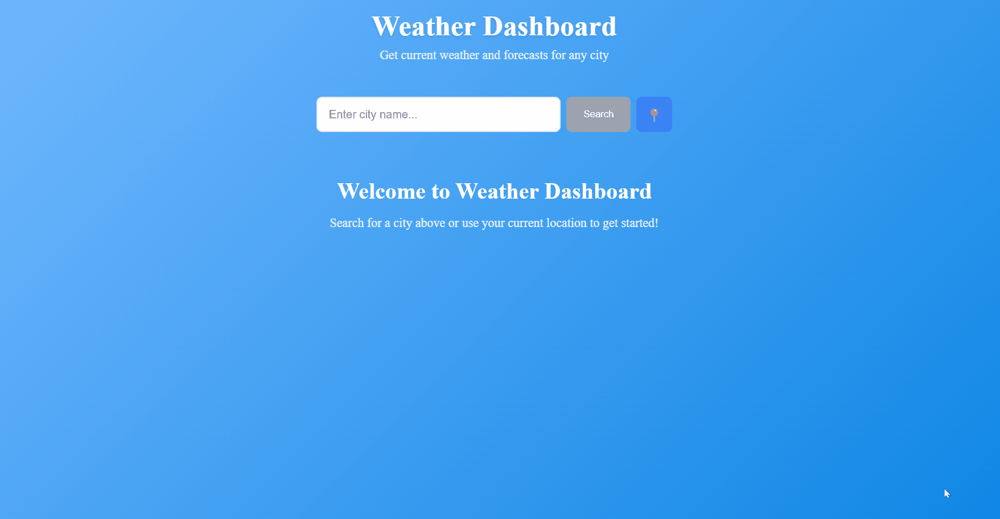

# Angular Weather Dashboard ☀️🌧️

A clean and responsive weather dashboard built with Angular.

## Demo
👉 Live Demo (link coming soon)

## Features
- Search weather by city
- 5-day forecast
- Responsive design

## Setup
1. Clone the repo
2. Run `npm install`
3. Add your API key in `src/environments/environment.ts`
4. Run `ng serve`
